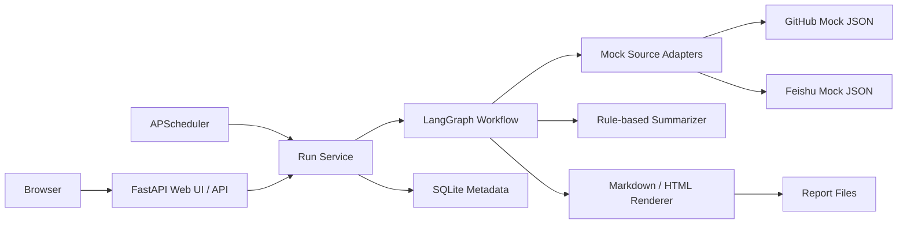
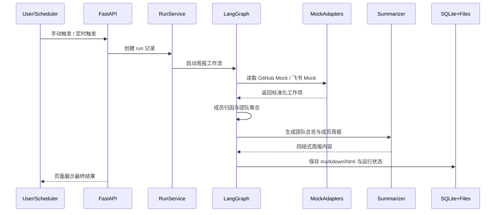

# Weekly Report Agent 设计说明

## 1. 目标

实现一个可配置、可演示、可扩展的团队工作周报助手：

- 每周五 17:00 自动生成团队周报
- 支持 Web UI 立即生成
- 汇总 GitHub / 飞书数据
- 输出 Markdown 与 HTML
- 预留未来替换真实 GitHub / 飞书 API 的能力

## 2. 技术选型

- 后端：FastAPI
- 模板渲染：Jinja2 + HTMX
- Agent 编排：LangGraph
- 调度：APScheduler
- 配置：Pydantic + YAML/JSON Loader
- 存储：SQLite + 本地文件系统
- 测试：pytest + httpx

## 3. 架构图

## 4. 核心流程

## 5. 领域模型

- `MemberProfile`
  - 团队成员身份主表
  - 维护 GitHub / 飞书身份映射
- `NormalizedWorkItem`
  - 各类数据源统一后的标准工作项
  - 后续所有归因和汇总都基于该模型
- `TeamAggregationContext`
  - 团队聚合中间态
  - 保存成员桶、未归因项和数据源健康信息
- `TeamWeeklyReport`
  - 最终报告结构
- `ReportRun`
  - 单次生成任务状态

## 6. 配置字段摘要

| 配置项 | 用途 |
| --- | --- |
| `schedule.*` | 定时触发 |
| `team.*` | 团队成员映射 |
| `sources.github.*` | GitHub 数据源 |
| `sources.feishu.*` | 飞书数据源 |
| `report.*` | 报告模板、输出与时间窗口 |
| `llm.*` | 汇总模式与未来模型配置 |
| `app.*` | 服务与存储路径 |

## 7. 扩展点

### 真实 GitHub API

替换 `GitHubMockAdapter`，保留 `NormalizedWorkItem` 输出结构。

### 真实飞书 API

替换 `FeishuMockAdapter`，保留 `NormalizedWorkItem` 输出结构。

### 新增数据源

后续可新增：

- `ZenTaoAdapter`
- `YuqueAdapter`

只需实现统一 Adapter 协议，并在 Agent 工作流中接入对应节点即可。

## 8. 容错策略

- 单数据源失败时仍输出部分成功报告
- 未归因工作项集中展示并标记告警
- 同一时间只允许一个运行中的任务
- 所有最终产物落盘并记录到 SQLite，便于追踪和复查

